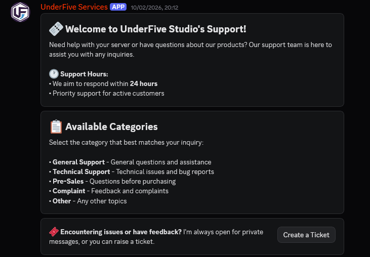
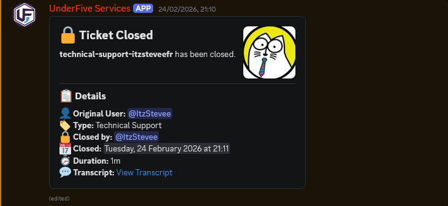
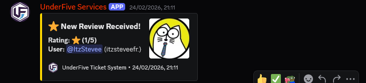
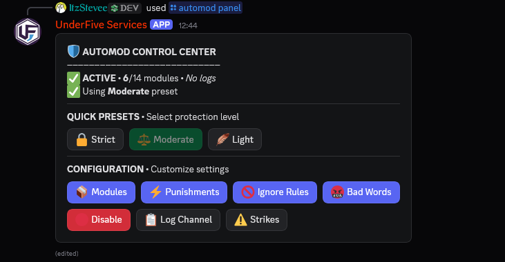
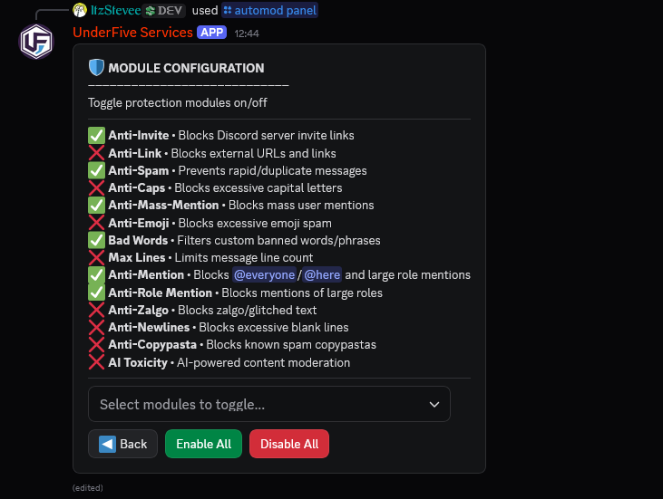

# UnderFive Studios Discord Bot

A modern, production-ready Discord bot focused on **ticketing, moderation, automod, giveaways, and server utility workflows** built with Discord.js v14.

## Table of Contents
- [Features](#features)
- [Systems Overview](#systems-overview)
- [Command Reference](#command-reference)
- [Installation](#installation)
- [Configuration](#configuration)
- [Run the Bot](#run-the-bot)
- [Project Structure](#project-structure)
- [Showcase](#showcase)
- [Tech Stack](#tech-stack)

## Features
- 🎫 Complete ticket lifecycle with setup, participant management, rename, close, and stats.
- 🛡️ Moderation toolkit (ban, kick, tempban, warns, purge, lock controls).
- 🤖 Advanced automod control panel with presets, bad-word management, strike handling, and logs.
- 🎉 Full giveaway system (start, end, reroll, list, cancel, edit) with entry requirements.
- 📩 Invite tracking and random member picker utilities.
- 🧩 Interactive embed builder with create/send/edit/copy flows.
- 🧠 Smart managed messages for home, partner, terms, and ticket panel channels.
- 🕒 Timeout and lifecycle background checks for moderation/ticket workflows.

## Systems Overview
### 1) Ticket System
- Interactive ticket panel and category-based ticket creation.
- Ticket commands for setup, add/remove members, rename, close, and analytics.
- Configurable category/log/support routing.

### 2) Moderation System
- Core moderation actions: ban, kick, tempban, warnings, and bulk delete.
- Server/channel lock management with ignore lists.
- Persistent warning and moderation data tracking.

### 3) AutoMod System
- Central automod command and panel UI.
- Enable/disable, presets, log channel setup, and reset tools.
- Bad-word lists, strike expiry, and escalation actions.

### 4) Giveaway System
- Rich giveaway publishing with duration parsing and winner handling.
- Role/account-age/server-stay requirement checks.
- Persistent active giveaway recovery on bot restart.

### 5) Utility & Engagement
- Invite statistics tracking.
- Fun command suite and coinflip tools.
- Random member picker with role and bot filters.
- Embed builder for structured announcements.

## Command Reference

### Ticket Commands
| Command | Description |
|---|---|
| `/ticket-setup` | Send the ticket panel to a channel. |
| `/ticket-add` | Add a user to the current ticket. |
| `/ticket-remove` | Remove a user from the current ticket. |
| `/ticket-rename` | Rename the current ticket channel. |
| `/ticket-close` | Close the current ticket and finalize logs. |
| `/ticket-stats` | Show ticket system statistics. |

### Moderation Commands
| Command | Description |
|---|---|
| `/moderation ban` | Ban a user. |
| `/moderation warn` | Warn a user and store warning data. |
| `/moderation clear-warnings` | Clear all warnings for a user. |
| `/kick` | Kick a user. |
| `/tempban` | Temporarily ban a user (duration supported). |
| `/delete` | Bulk delete messages with optional filters. |
| `/deletechannel` | Delete a channel. |
| `/lock channel` | Lock/unlock a specific channel. |
| `/lock server` | Lock/unlock all channels. |
| `/lock ignore` | Manage channels excluded from server lock. |

### AutoMod Commands
| Command | Description |
|---|---|
| `/automod panel` | Open the automod control panel. |
| `/automod enable` | Enable automod system. |
| `/automod disable` | Disable automod system. |
| `/automod preset` | Apply a protection preset. |
| `/automod config` | View current automod configuration. |
| `/automod logchannel` | Set automod violation log channel. |
| `/automod reset` | Reset automod to defaults. |

### Giveaway Commands
| Command | Description |
|---|---|
| `/giveaway start` | Start a giveaway with customizable options and requirements. |
| `/giveaway end` | End an active giveaway manually. |
| `/giveaway reroll` | Reroll winners for a giveaway. |
| `/giveaway cancel` | Cancel an active giveaway. |
| `/giveaway list` | List active giveaways. |
| `/giveaway edit` | Edit giveaway properties after launch. |

### Utility / General Commands
| Command | Description |
|---|---|
| `/general ping` | Check bot/API latency. |
| `/general membercount` | Show server member count. |
| `/invites` | View invite stats (self or target user). |
| `/randommember` | Pick a random server member. |
| `/coinflip` | Flip a coin. |
| `/embed create` | Open interactive embed builder UI. |
| `/embed send` | Send an embed from code. |
| `/embed edit` | Edit an existing embed message by ID. |
| `/embed copy` | Convert an existing embed to reusable code. |
| `/embed variables` | List available dynamic embed variables. |
| `/fun 8ball` | Ask the magic 8ball a question. |
| `/fun choose` | Pick from a list of options. |
| `/fun hack` | Run a playful “hack” simulation. |
| `/fun rate` | Rate a user/text. |
| `/fun roll` | Roll a number up to a limit. |
| `/fun ship` | Compatibility check between users. |

## Installation
```bash
git clone <your-repo-url>
cd Discord-Bot
npm install
```

## Configuration
1. Copy the example config:
   ```bash
   cp config.example.json config.json
   ```
2. Fill required values in `config.json`:
   - `token`
   - `clientId`
   - `guildId`
   - Ticket, log, and support channel/role IDs

## Run the Bot
```bash
npm run deploy   # register slash commands
npm start        # start production bot
```

For development:
```bash
npm run dev
```

## Project Structure
```text
commands/        Slash commands and command logic
handlers/        Interaction handlers (buttons, automod, invites)
utils/           Shared helpers (tickets, embeds, automod, logging, etc.)
database/        JSON/SQLite persistence helpers and data
messages/        Managed static message payloads
config/          Config helpers and reusable embed/theme settings
bot-assets/      Screenshots and showcase media
```

## Showcase
> Screenshots and media from `bot-assets/`.

### UI Screenshots






### Video Showcases
- [Workflow Demo 1](bot-assets/1.mkv)
- [Workflow Demo 2](bot-assets/2.mkv)

## Tech Stack
- **Runtime:** Node.js (>=18)
- **Framework:** discord.js v14
- **Storage:** better-sqlite3 + JSON files + optional MongoDB connection layer
- **Utilities:** Winston logging, dotenv, ms, discord-html-transcripts

---
If you deploy this bot in production, make sure to secure your token, limit privileged intents to what you need, and review role permissions for moderation commands.
